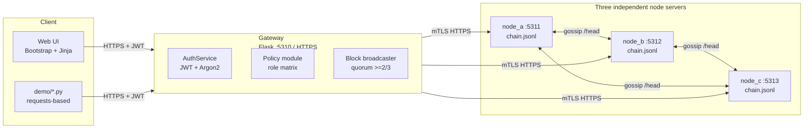
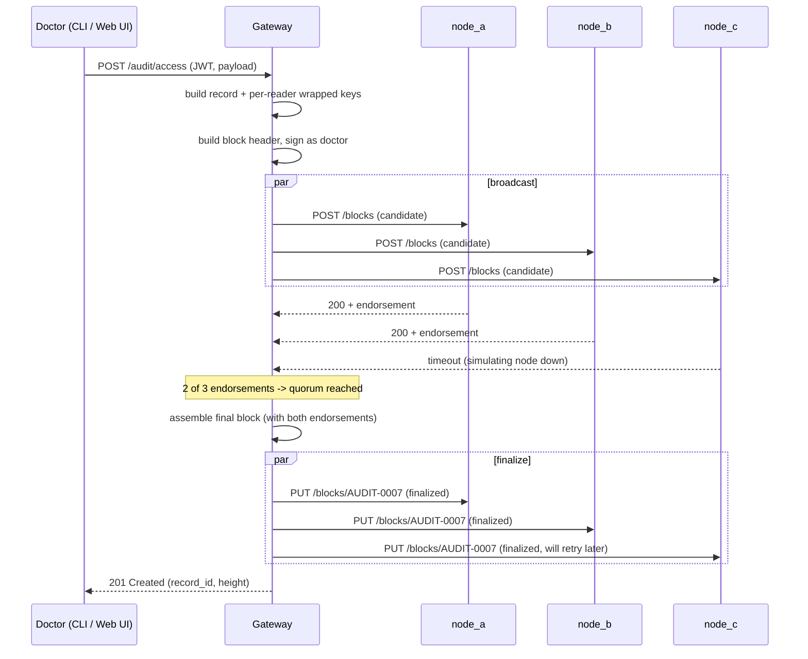

# Revamp Plan — Designing A Secure Decentralized Audit System

> Companion document to [TODO.md](TODO.md). Read TODO.md for the actionable checklist; read this for *why* the design looks the way it does and *how* the pieces fit together.

---

## 1. Goal restatement

The assignment (Option 2) requires a prototype that demonstrates **five goals**: privacy, identification + authorization, queries, immutability (with detection of tampering), and decentralization. Bonus 5 % is awarded for a *realistic* distributed system with a web UI and components running on more than one machine / process.

The current code already proves the five goals on paper but does so inside a single Python process, with three JSON files written by one writer. That is technically a "single trusted entity" and would be marked down on rubric items 2 (architecture, 15 pts), 4 (how system meets requirements, 10 pts) and the 5 % bonus.

The revamp turns the prototype into a small but genuine distributed system: a stateless gateway, three independent node servers, a quorum-based commit protocol, end-to-end TLS, per-record envelope encryption, actor signatures, JWT auth, and a Bootstrap web UI.

---

## 2. Target architecture



### Components

| Component | Role | Trust model |
|-----------|------|-------------|
| Web UI | Presentation layer; talks only to the gateway. | Untrusted. |
| Gateway | Authentication, authorization, JWT issuance, block creation, broadcast. **Stateless** for audit data; only owns the user/key registry. | Trusted for *issuing* identities; **not** trusted for storing audit data — kill it and the data still lives on the nodes. |
| Node × 3 | Independent ledgers. Each has its own Ed25519 keypair, its own append-only `chain.jsonl`, and its own HTTPS endpoint. | Pairwise mutually distrusting. Tamper detection works as long as **at least one** node is honest, because a single honest node's chain disagrees with the tampered ones. |
| Demo CLI | Drives the gateway over HTTPS to record evidence for the video. | Same trust as a normal client. |

### Why this satisfies the rubric

- **Privacy** — sensitive payload is encrypted with AES-256-GCM under a *per-record* data key that is wrapped with each authorised reader's public key (RSA-OAEP-2048). The gateway cannot decrypt past records, only the patient + audit companies can. TLS protects in-transit. Disk is ciphertext-only.
- **Identification & authorization** — JWT (HS256) issued by the gateway with `exp`, `iat`, `jti`. Argon2 password hashing. Role matrix enforced in `policy.py`. Every doctor/admin also has an Ed25519 signing key whose public half is in the user registry → non-repudiation.
- **Queries** — gateway endpoints `GET /audit/patient/<id>` and `GET /audit/all` enforce role + ownership before fetching. The patient route also performs a quorum read: it pulls the chain from all reachable nodes, picks the majority chain, and only decrypts records whose hash chain links match.
- **Immutability** — block header SHA-256 chain + Merkle root + actor signature + node endorsements. Three independent disks → tampering one node leaves two honest copies that disagree, which the verification endpoint detects and reports.
- **Decentralization** — three real processes, three real ports, three real on-disk chains, three independent node keypairs. Gateway is stateless for audit data, so even if it goes away the chain survives.
- **Bonus 5 %** — Docker compose runs everything on a network of containers, web UI is the demo surface, three node services run independently.

---

## 3. Cryptographic primitives summary

| Need | Primitive | Library |
|------|-----------|---------|
| Symmetric encryption of audit payload | AES-256-GCM | `cryptography` |
| Wrap per-record AES key for each reader | RSA-OAEP-SHA256-2048 (or X25519+HKDF if we want post-classical-friendly) | `cryptography` |
| Hash chain + Merkle root | SHA-256 | stdlib `hashlib` |
| Actor non-repudiation | Ed25519 sign/verify | `cryptography` |
| Node block endorsement | Ed25519 sign/verify | `cryptography` |
| Password hashing | Argon2id (memory=64 MiB, parallelism=2, time=3) | `argon2-cffi` |
| Session token | JWT HS256 with short `exp` | `PyJWT` |
| TLS in transit | TLS 1.3, self-signed CA in `data/tls/` | `cryptography` for cert gen |

Document each of these in section 3 of the report ("Cryptographic components") with: what it protects, why it was chosen, and what the alternative would have been.

---

## 4. Block + record schema

```json
{
  "version": 1,
  "block_id": "AUDIT-0007",
  "height": 7,
  "previous_hash": "<sha256 hex of previous block header>",
  "merkle_root": "<sha256 hex of records merkle tree>",
  "timestamp": "2026-04-29T18:42:11Z",
  "records": [
    {
      "record_id": "AUDIT-0007.1",
      "patient_id_hash": "<sha256 hex of patient_id, used for indexed lookup without leaking>",
      "ciphertext": "<b64>",
      "nonce": "<b64>",
      "tag": "<b64>",
      "wrapped_keys": [
        { "reader_id": "patient_03",       "alg": "RSA-OAEP-256", "value": "<b64>" },
        { "reader_id": "audit_company_01", "alg": "RSA-OAEP-256", "value": "<b64>" },
        { "reader_id": "audit_company_02", "alg": "RSA-OAEP-256", "value": "<b64>" },
        { "reader_id": "audit_company_03", "alg": "RSA-OAEP-256", "value": "<b64>" },
        { "reader_id": "admin_01",         "alg": "RSA-OAEP-256", "value": "<b64>" }
      ]
    }
  ],
  "actor_signature": {
    "alg": "Ed25519",
    "signer": "doctor_01",
    "value": "<b64 signature over canonical(block header without endorsements)>"
  },
  "node_endorsements": [
    { "node_id": "node_a", "alg": "Ed25519", "value": "<b64>" },
    { "node_id": "node_b", "alg": "Ed25519", "value": "<b64>" }
  ]
}
```

Notes:

- `patient_id_hash` lets the gateway look up "all blocks for patient X" without storing patient_id in the clear. The hash is salted with a per-deployment value held by the gateway.
- `previous_hash` covers the whole header *including* `merkle_root`, so any change to any record invalidates the chain.
- `node_endorsements` is appended *after* signing. They're proof that ≥2 nodes saw and accepted the block; they are themselves signed over the same header bytes the actor signed.
- One record per block is fine for the prototype. Merkle root degenerates to `sha256(record canonical bytes)`.

---

## 5. Commit protocol



Failure handling:

- If fewer than 2 endorsements within 2 s, gateway returns 503 and does not finalize. No partial state.
- If a node was offline during finalize, on next `/health` it advertises a lower height; the gateway (or any peer) catches it up via `/blocks?from=<height>`.
- If a node disagrees on `previous_hash` during candidate validation, it rejects with 409 and includes its own head — gateway logs and surfaces this on `/verify` as "fork detected."

---

## 6. Tamper-detection narrative for the demo

The PDF specifically asks us to "demonstrate how your system enforces immutability by implementing a scenario where an attacker tampers with some audit data and the system reports the attack." Our story:

1. Fresh state. `/verify` returns `all_checks_passed: true` with all three nodes at the same height + Merkle root.
2. The "insider attacker" opens `data/nodes/node_b/chain.jsonl` in a text editor and flips one byte of `ciphertext` in block 3.
3. `/verify` now returns:
   - per-node report for `node_b`: AES-GCM authentication failed, Merkle root mismatch, hash chain broken from height 3.
   - per-node report for `node_a`, `node_c`: clean.
   - `network_consistent: false`, `network_mismatches: ["node_b diverges from majority chain at height 3"]`.
   - `majority_chain: [node_a, node_c]` — system still serves reads from the honest majority.
4. The web UI shows a red banner: *"Tampering detected on node_b at AUDIT-0003. Reads served from node_a, node_c."*

This single demo simultaneously proves: immutability detection, decentralization (without `node_a`+`node_c` we couldn't reject `node_b`), and graceful degradation.

---

## 7. Threat model + assumptions to put in the report

In scope:

- **T1** Internal attacker with shell access to one node: caught by chain + cross-node verification.
- **T2** Eavesdropper on the network: defeated by TLS 1.3 + AES-GCM at rest.
- **T3** Compromised gateway (post-issuance): cannot read past records (no decryption keys held), cannot rewrite past blocks (would need actor + node signatures).
- **T4** Replay of stolen JWT: bounded by short `exp` and `jti` blacklist on logout.
- **T5** Brute-force login: bounded by Argon2 cost + lockout after 5 failures.

Out of scope (state explicitly):

- Compromise of ≥2 nodes simultaneously.
- Compromise of the user registry (would let the attacker mint identities).
- Side-channel attacks against AES-GCM or RSA.
- Quantum adversaries.
- Real key-rotation lifecycle (we discuss it but don't implement it).

---

## 8. Build order (recommended sprints)

The TODO file is exhaustive; here is a sane order of execution so each step has something demoable.

| Sprint | Deliverable | Demo at the end |
|--------|-------------|-----------------|
| S1 | Project hygiene + restructure into `gateway/`, `node_server/`, `web/`, `crypto/`, `models/`, `policy/`. Move existing logic over. | Old demos still pass. |
| S2 | Standalone node server (one process, one port). Append-only `chain.jsonl`. Endorsement-less commit. | `curl` posts a block, gets it back. |
| S3 | Spin up three nodes + gateway broadcast (still no quorum yet, just fan-out). | All three node files contain the same blocks, written by separate processes. |
| S4 | Add Ed25519 actor signing + node endorsements + 2/3 quorum + retry on missing node. | Kill node_c, still works. |
| S5 | Per-record envelope encryption (per-reader RSA-OAEP wrap). | Patient sees only their wrapped key; audit company unwraps any. |
| S6 | JWT + Argon2 + role policy module. | `pytest tests/test_authz.py` green. |
| S7 | TLS everywhere (self-signed CA + per-service certs). | All HTTP calls become HTTPS. |
| S8 | Web UI (Flask + Bootstrap). | Login → dashboard → tamper detection visible in browser. |
| S9 | New demo CLI scripts + recording script. | Run-all script ends in green/red verify. |
| S10 | Tests + Docker compose + final docs + report PDF. | `docker compose up` brings the whole system online. |

If the deadline is tight, S8 (web UI) can be downgraded to a single-page Bootstrap dashboard rendered server-side by the gateway — this still scores the 5 % bonus.

---

## 9. Risks + mitigations

| Risk | Mitigation |
|------|------------|
| RSA wrap blows up record size | Acceptable for prototype; alternative is X25519+HKDF (32-byte ephemeral). Document the choice. |
| Self-signed TLS confuses graders during demo | Pre-trust the CA in the demo script and screenshot it; document the curl `--cacert` flag clearly. |
| Three-process orchestration is fragile on Windows | Provide both PowerShell and bash launchers, plus the docker-compose path which avoids the issue entirely. |
| Time pressure | Sprint plan above gives a working system after every sprint, so partial completion is still demoable. |

---

## 10. What we keep from the existing code

- AES-GCM helpers in [crypto/crypto_manager.py](crypto/crypto_manager.py) — extend, don't rewrite.
- Hash-chain idea in [audit/service.py](audit/service.py) — generalise to block-level hashing.
- User dataclass + sample user generator in [auth/service.py](auth/service.py) — port into the new gateway.
- Demo flow ideas (tamper, unauthorized query) — keep the scenarios, change the transport to HTTP.
- README compliance checklist — keep but rewrite each row to point to the new architecture.

What we throw away:

- Single-process `system.AuditSystem` aggregator.
- Direct service-layer calls inside demos.
- The "primary node" reads (`_decrypt_records_from_primary`) — replaced with quorum reads.
- Hand-rolled HMAC token format — replaced with PyJWT.
