# Report

### Title: Secure Decentralized EHR Audit System

**Course:** CSCI-531 Applied Cryptography  
**Selected Option:** Option 2  
**Project Type:** Semester Project Report

### Team Information

| Name | USC ID | Role |
| --- | --- | --- |
| Rohit Joshi | 3999854898 | Student |
| Shubham Chaudari | 3588799175 | Student |

## 1. System Workflow

The implemented system is a secure decentralized audit platform for Electronic Health Record (EHR) access events. It supports four user roles: `patient`, `doctor`, `audit_company`, and `admin`. The workflow begins when a user authenticates through the gateway service. The gateway verifies the submitted username and password against the Postgres-backed user store and, if authentication succeeds, issues a signed JSON Web Token (JWT) with a limited lifetime.

When an authorized writer, namely a doctor or an admin, accesses EHR data, the gateway creates a new audit event. The plaintext payload includes the timestamp, patient ID, user ID, action type, and audit details. Before the record is written to any node, the gateway encrypts the sensitive payload using a fresh AES-256-GCM data key generated for that record. The data key is then wrapped separately for each authorized reader using RSA-OAEP. Authorized readers include the patient who owns the record, all audit companies, and the admin. Doctors can create records, but they are intentionally excluded from the wrapped-key list, so they cannot later decrypt the stored audit log content.

After encryption, the gateway constructs a block containing the encrypted record, the previous block hash, a new current hash, and the actor signature. The actor signature is produced with Ed25519 by the doctor or admin who created the record. The gateway then broadcasts the block to three independent node servers. Each node validates the height, previous hash, and recomputed block hash before appending the block to its local append-only ledger. The gateway requires at least two successful node endorsements before it considers the write durable.

For queries, patients may request only their own audit records, while audit companies and the admin may request records for any patient or all patients. The gateway reads from the majority chain, finds the wrapped key intended for the requester, unwraps it with the requester's private RSA key, and decrypts the payload. If the requester is not authorized, the decryption step is not available and the request is denied at the policy layer.

Integrity verification is performed through a dedicated verification routine. The gateway fetches the ledgers from all three nodes, recomputes the chain links and block hashes, verifies the actor signatures, and then compares the chains across nodes. If one node has been tampered with, the system reports both per-node integrity failures and cross-node divergence.

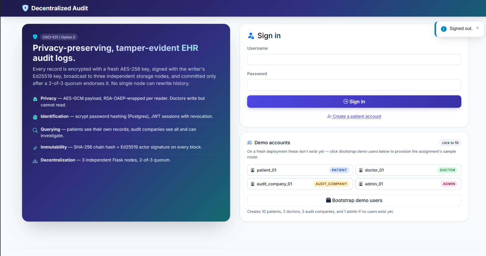

## 2. System Architecture

The architecture is divided into four major parts: the gateway, the decentralized audit nodes, the persistence layer, and the user-facing interfaces.

The gateway is a Flask application that serves as the coordination point for authentication, authorization, audit creation, audit queries, and verification. It does not store the decentralized ledger itself. Instead, it constructs blocks, enforces access policy, communicates with the nodes over HTTP, and collects node endorsements. The gateway also supports a web interface for human demonstration and a JSON API used by the demo scripts.

The decentralized storage layer consists of three independent Flask node servers: `node_a`, `node_b`, and `node_c`. Each node maintains its own append-only `chain.jsonl` ledger and its own persistent Ed25519 key pair. Nodes do not trust each other implicitly. Instead, each node validates incoming blocks locally before appending them.

The persistence model is intentionally split. The decentralized audit chain is stored separately on each node in JSON Lines format, while the gateway stores authentication-related state in Postgres. The gateway database contains users, hashed passwords, encrypted private keys, and JWT revocation entries. This separation reflects the system goal that audit immutability should not rely on a single trusted storage location.

The user-facing layer has two forms. First, there is a browser-based web UI implemented with Flask templates and static assets. Second, there is a set of demo scripts that interact with the gateway only through its public HTTP API. This separation helps demonstrate both user interaction and automated reproducibility.

From a deployment perspective, the system can run locally in a development setup with one gateway process, three node processes, and a Docker-hosted Postgres instance. It can also be launched with Docker Compose, where the gateway and each node run in separate containers. This supports the assignment's decentralization objective more closely than a single-process design.

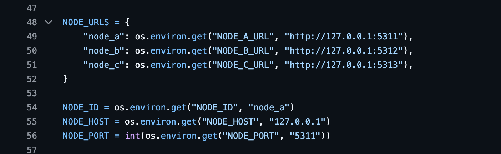

## 3. Cryptographic Components

The system uses several standard cryptographic primitives, each with a specific purpose tied to the assignment goals.

AES-256-GCM is used to protect the confidentiality and integrity of the sensitive audit payload. AES-GCM is an authenticated encryption mode, so it not only encrypts the plaintext but also detects any tampering with the ciphertext or authentication tag. This is important because the assignment requires both privacy and tamper detection.

RSA-OAEP with SHA-256 is used to wrap the per-record AES key for each authorized reader. The system does not encrypt the record separately for every reader. Instead, it encrypts the record once with a fresh AES key and then wraps that AES key individually for each permitted reader. This is a standard envelope-encryption design and makes it possible for multiple authorized readers to decrypt the same record without sharing a single long-term symmetric key.

Ed25519 is used for actor signatures and node endorsements. When a doctor or admin creates a record, the actor signs the canonical block header. Each node can later verify this signature during integrity checks. In addition, nodes produce their own endorsement signatures when they accept a block, providing evidence that the write achieved quorum.

SHA-256 is used for the block hash chain and for the `patient_id_hash` field stored in each record. The chain hash links every block to the previous block, so later modification of a block changes the recomputed hash and breaks the integrity check. The patient ID hash is used as a query index without storing the plaintext patient ID directly in the ledger record header.

scrypt is used for password hashing. The code uses a memory-hard password hashing function rather than a plain hash, which is appropriate for protecting stored credentials.

JWT with HS256 is used for session tokens. Tokens include expiration time, issue time, not-before time, the user role, patient ID where relevant, and a unique token identifier (`jti`). Revoked tokens are stored in Postgres so that logout or revocation survives a gateway restart.

## 4. How the System Meets the Requirements

### Privacy

The system protects sensitive audit data by encrypting the audit payload before it is stored on any node. The encrypted portion contains the timestamp, patient ID, user ID, action type, and audit details. Each record uses a fresh AES-256-GCM key, and the encrypted record is stored with its nonce, tag, ciphertext, and wrapped keys. This satisfies the requirement to protect sensitive data at rest. In local development, transport is plain HTTP for practicality, but data is still encrypted before node replication, so the record content is not transmitted or stored in plaintext at the node level.

### Identification and Authorization

Users authenticate with username and password. Passwords are stored using scrypt rather than plaintext or a simple hash. After login, the gateway issues a JWT and enforces role-based access control through centralized policy checks. Patients may query only their own data, audit companies may query all patients' audit data, and doctors may create records but cannot query audit logs. The admin role has broad management and verification capabilities.

### Queries

The system supports authorized audit queries for both patients and audit companies. Patients can view only records associated with their own patient ID. Audit companies can query all records, and the admin can do the same. The gateway decrypts records only when the requester is authorized and has a wrapped key for the record. Unauthorized requests are denied rather than returning partially visible sensitive content.

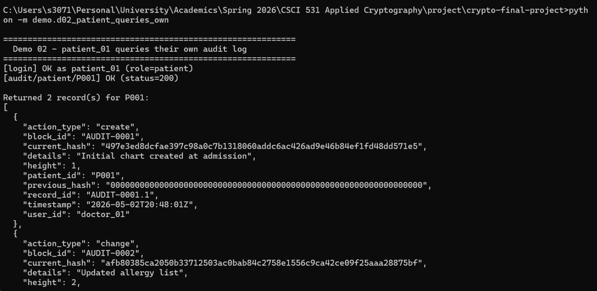

### Immutability and Tamper Detection

Each block stores both `previous_hash` and `current_hash`, and the verification logic recomputes the expected hash chain from the stored data. Every block also includes an actor signature, which is re-verified during integrity checking. If a node ledger is modified after the fact, either the recomputed hash, the chain linkage, or the signature verification will fail. The tamper demo intentionally modifies one node's stored data so that verification reports the inconsistency.

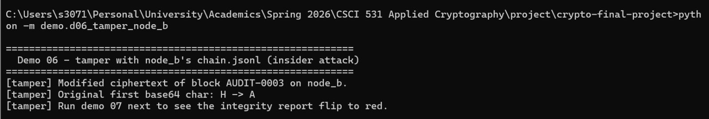

### Decentralization

The system does not rely on a single ledger. Instead, it runs three independent node services, each maintaining its own append-only chain. The gateway requires a two-out-of-three quorum of node endorsements before a write is treated as successful. For reads, the gateway selects the majority chain when possible. Verification also compares the per-height block hashes across nodes and reports divergence if one node differs from the others. This satisfies the assignment's decentralization objective within a local prototype.

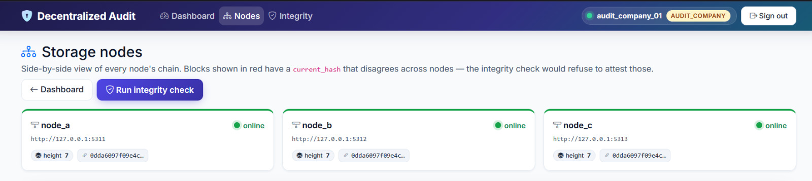

## 5. System Assumptions and Limitations

The current implementation makes several explicit assumptions that should be acknowledged in the final report.

First, the project is a prototype designed for local demonstration. In the standard development setup, gateway-to-node communication uses plain HTTP rather than TLS. This should not be presented as a production-ready network security design. The protection that does exist in transit comes from encrypting the sensitive payload before replication, not from secure transport channels.

Second, the gateway is part of the trusted computing base for the prototype. It performs encryption, authorization, key lookup, and decryption on behalf of authorized users. Although the node ledgers are decentralized, the gateway still plays a central orchestration role.

Third, the system stores `patient_id_hash` as a plain SHA-256 hash of the patient ID. This avoids storing the plaintext patient ID directly in the record header, but it does not eliminate all linkage risk if patient IDs are easily guessable. A production system would likely use a keyed hash or tokenization service instead.

Fourth, the private keys needed for authorized decryption and signing are stored by the system, encrypted at rest under a gateway master key. This is acceptable for a course prototype, but stronger deployments would use a dedicated key-management service or hardware-backed protection.

Fifth, the system favors integrity and majority consistency over full availability. The gateway requires a quorum of node endorsements for writes. If too many nodes are unavailable, the system can reject the write rather than risk committing a record without sufficient decentralized confirmation.

Finally, the verification mechanism detects tampering but does not by itself repair a corrupted node automatically. The project therefore satisfies the assignment requirement of detecting unauthorized modification, but not a stronger self-healing or consensus-recovery objective.

## 6. Implementation Details

The core cryptographic primitives are implemented in `crypto/primitives.py` and `crypto/envelope.py`. These modules handle AES-GCM encryption and decryption, RSA-OAEP key wrapping and unwrapping, Ed25519 signing and verification, SHA-256 hashing, and scrypt password hashing.

User management is implemented in `auth/user_store.py`. This module stores user accounts in Postgres, creates the required role-specific keys, supports authentication, records failed logins, and locks accounts after too many failed attempts. Session handling is implemented in `auth/jwt_service.py`, which issues and verifies JWTs and stores revoked token identifiers in the database.

Authorization decisions are concentrated in `auth/policy.py`. This is important because it keeps role permissions reviewable in one place rather than scattering authorization logic across many route handlers.

The gateway-side audit workflow is implemented in `gateway/audit_service.py`. This module creates blocks, encrypts records, signs them, broadcasts them to the nodes, collects endorsements, reads from the majority chain, decrypts records for authorized users, and verifies integrity across all nodes.

Node-side ledger handling is implemented in `node_server/chain.py`. This module provides append-only storage, chain validation, and full-chain replacement for synchronization. Each node keeps its own ledger in `data/nodes/<node_id>/chain.jsonl`.

The web interface is implemented in `gateway/app.py` together with templates under `web/templates/`. The demo scripts under `demo/` exercise the public API and provide reproducible evidence for the major flows required by the assignment.

The repository also includes automated tests in `tests/`, covering cryptography, authorization behavior, and node-server validation paths. These tests are useful supporting evidence in the report, but the report should not claim formal security proofs.

## 7. Demo Instructions

The simplest demo flow is to start Postgres with Docker, start the three node servers and the gateway, and then run the scripted demos.

Startup sequence:

1. Create and activate a Python virtual environment.
2. Install dependencies with `pip install -r requirements.txt`.
3. Start Postgres with `docker compose up -d postgres`.
4. Start the gateway and three nodes with `python3 scripts/dev.py`.

Demo sequence:

1. `python3 -m demo.d00_bootstrap`
2. `python3 -m demo.d01_doctor_creates_audits`
3. `python3 -m demo.d02_patient_queries_own`
4. `python3 -m demo.d03_patient_queries_other`
5. `python3 -m demo.d04_audit_company_queries_all`
6. `python3 -m demo.d05_unauthorized_doctor`
7. `python3 -m demo.d07_verify`
8. `python3 -m demo.d06_tamper_node_b`
9. `python3 -m demo.d07_verify`

This order shows the complete story: user initialization, authorized record creation, patient access, denied access, audit-company access, clean verification, intentional tampering, and detected tampering.

## 8. Screenshots:

- Patient viewing their data: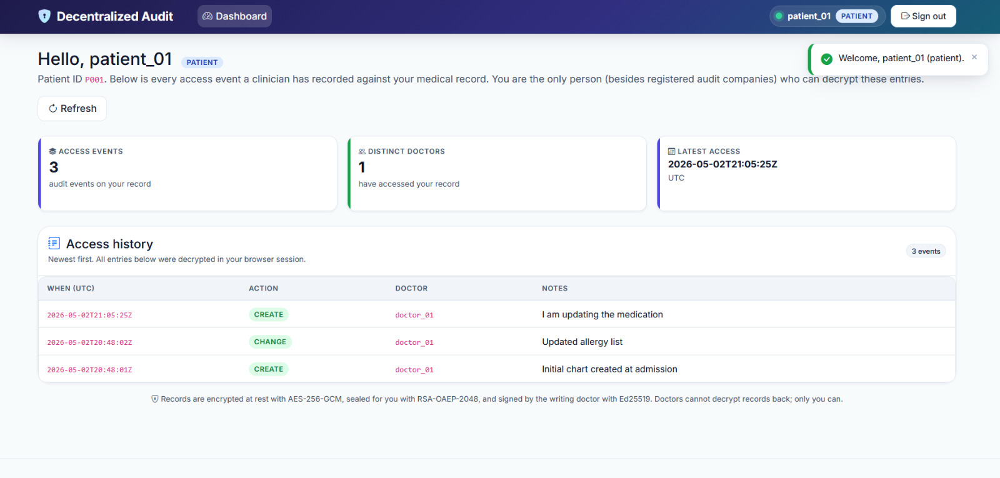
- Doctor creating audit record: 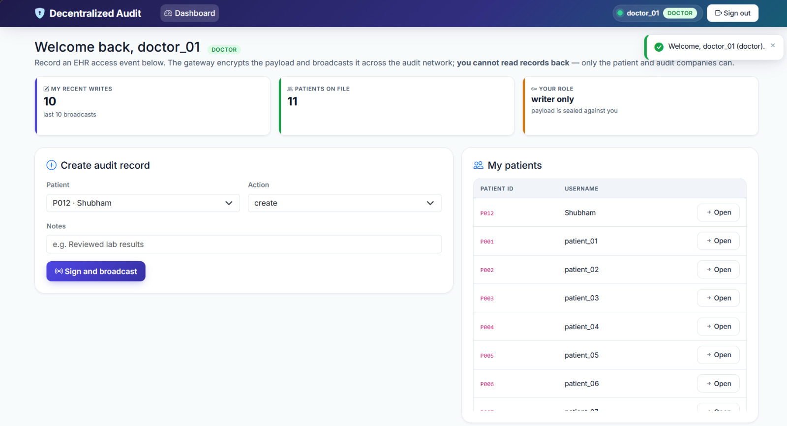
- 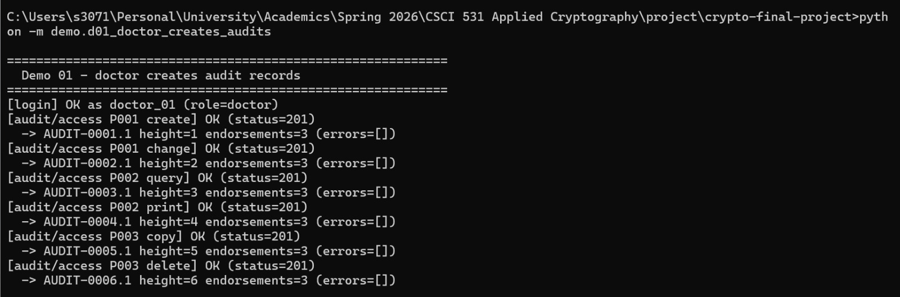
- Patients authorized access to their own data: 
- Patients unauthorized access to other patients data: 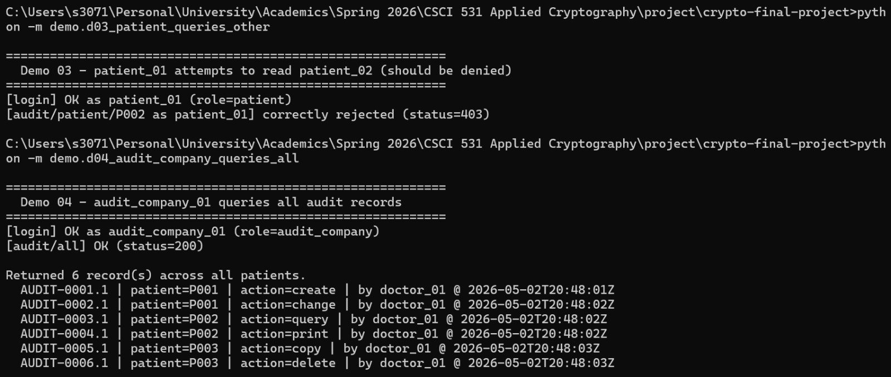
- Audit company querying all patients: 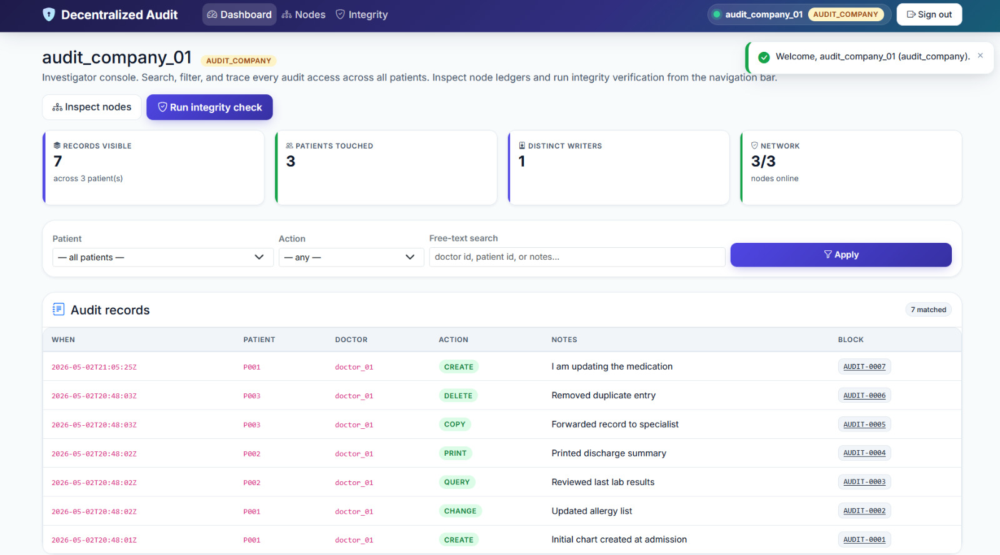
- Tampering node B: 
- Tampering Detected due to compromised Node B: 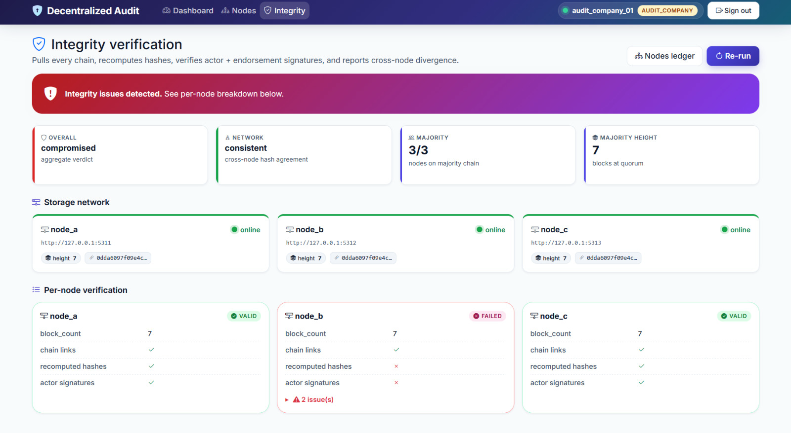
- Clean Integrity Test: 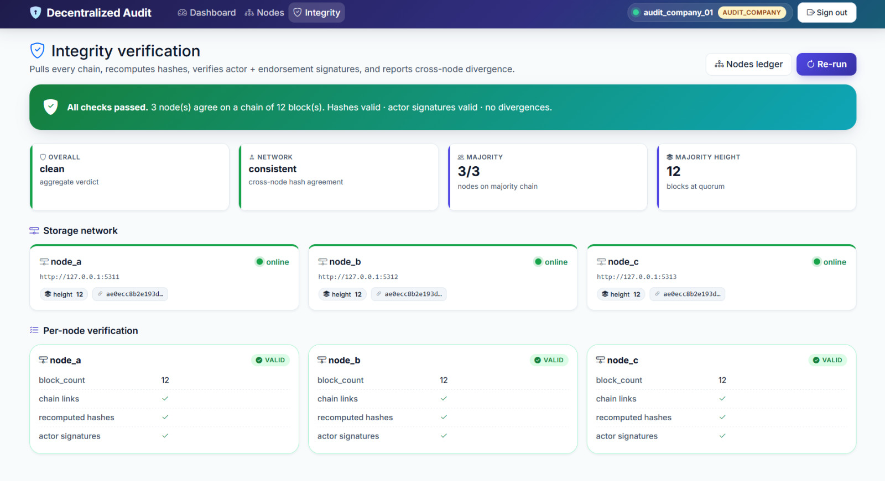

## 9. References

1. CSCI-531 semester project specification PDF provided in the course materials.
2. The `cryptography` library documentation for AES-GCM, RSA-OAEP, and Ed25519.
3. PyJWT documentation for JWT handling.
4. Flask documentation for the web framework and routing layer.
5. SQLAlchemy documentation for the Postgres-backed persistence layer.
6. RFC 7519, *JSON Web Token (JWT)*.
7. RFC 8017, *PKCS #1: RSA Cryptography Specifications*.
8. RFC 8032, *Edwards-Curve Digital Signature Algorithm (EdDSA)*.
9. NIST and standard references for AES-GCM or authenticated encryption, if additional formal citation is desired in the final paper.
